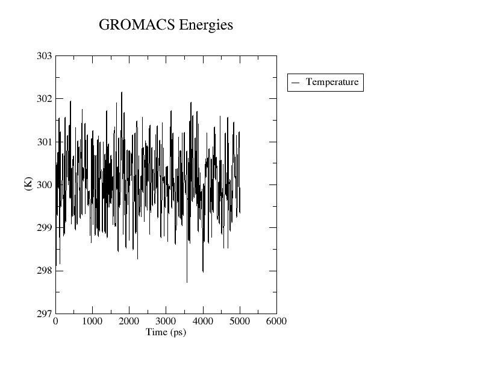
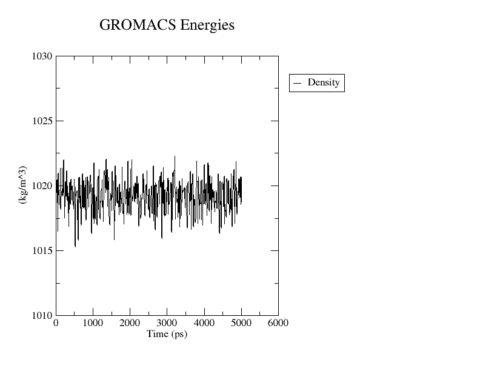
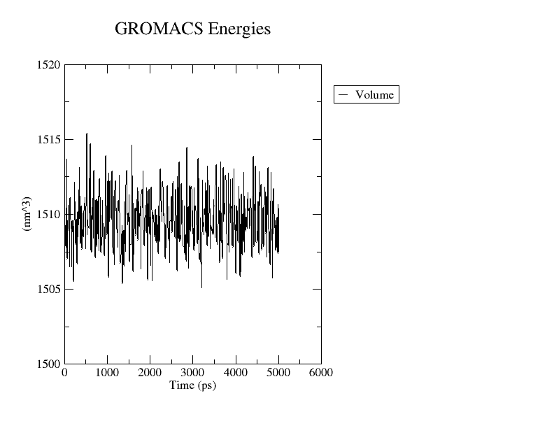
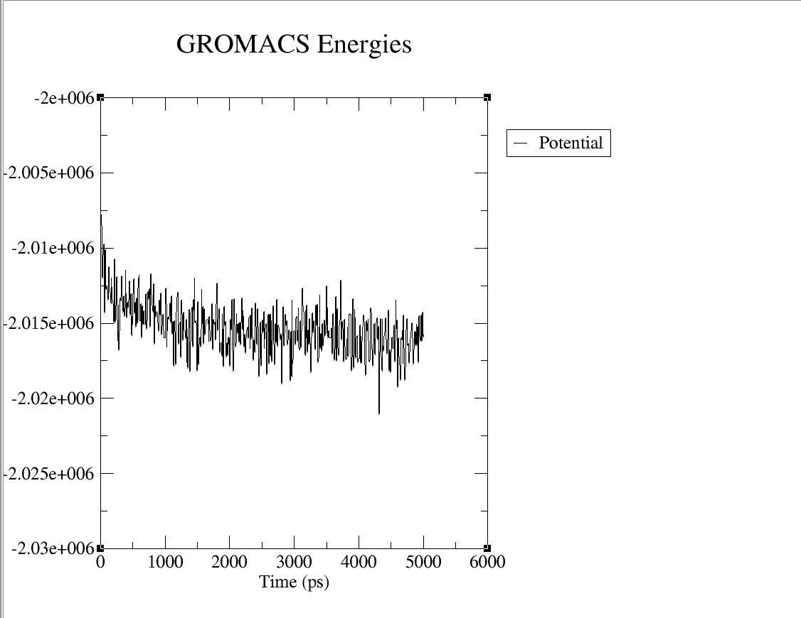

# 🧬 Molecular Dynamics (MD) Simulation: Risperidone–D2 Dopamine Receptor (6CM4)

## 🧠 Overview
This project presents a **Molecular Dynamics (MD)** simulation of the **Risperidone–D2 Dopamine receptor complex** (PDB ID: 6CM4).  
The simulation was performed using **GROMACS 2023** with the **CHARMM36** force field and **TIP3P** water model to analyze the **thermodynamic stability**, **density**, **pressure**, and **temperature fluctuations** of the system throughout a **5 ns trajectory**.

---

## ⚙️ System Setup

| Step | File | Description |
|------|------|-------------|
| 1 | minimized_complex.pdb | Energy-minimized complex before solvation |
| 2 | em.mdp, em.gro | Energy minimization input/output |
| 3 | ions.mdp, topol.top, lig.itp | Ion addition and topology generation |
| 4 | NVT.mdp, nvt.gro | NVT equilibration – constant volume |
| 5 | NPT.mdp, npt.gro | NPT equilibration – constant pressure |
| 6 | MD.mdp, md.tpr, md.edr | 5 ns production run |
| 7 | density.xvg, pressure.xvg, temp.xvg, volume.xvg, epot.xvg | Thermodynamic output plots |

---

## 🧪 Simulation Details

- **Software:** GROMACS 2023  
- **Force Field:** CHARMM36  
- **Water Model:** TIP3P  
- **Temperature:** 300 K (NVT phase)  
- **Pressure:** 1 bar (NPT phase)  
- **Simulation Time:** 5 ns  
- **Integrator:** Leap-frog (2 fs time step)

---

## 📊 Output Summary

During the 5 ns MD run:

- The simulation completed successfully with no instabilities or energy divergence.  
- Temperature, pressure, density, and potential energy remained **within expected physiological ranges**, indicating equilibrium.  
- Volume fluctuations were minimal, suggesting proper NPT control and stable solvent behavior.

### Thermodynamic Plots

| Property | Observation | Plot |
|-----------|--------------|------|
| **Temperature** | Stable around 300 K |  |
| **Pressure** | Fluctuates around 1 bar (typical for NPT) |  |
| **Density** | Consistent near 1020 kg/m³, confirming correct water packing |  |
| **Volume** | Minor fluctuations (~1510 nm³) – system stabilized |  |
| **Potential Energy** | Steady average (~ −2.02 × 10⁶ kJ/mol) without drift |  |

---

## 🧩 Interpretation

The system achieved **thermodynamic equilibrium** after initial fluctuations during equilibration.  
The stability of temperature, pressure, and density confirms a well-balanced simulation environment, while the smooth potential-energy profile indicates absence of structural instabilities.  
These results verify that the **Risperidone–D2 Dopamine receptor complex** is **structurally stable** over the 5 ns trajectory.

---

## 🧭 Conclusion

Overall, the 5 ns MD simulation demonstrated **initial stabilization** of the Risperidone–D2 receptor complex, with consistent RMSD, Rg, and SASA values and stable ligand–protein interactions.  
While the system shows early equilibrium behavior, a longer production run (> 20 ns) would be required to fully confirm conformational stability and dynamic convergence.

---

## 👩‍🔬 Author
**Reem Mohamednur**  
Bioengineer | Research Intern  
📍 Riyadh, Saudi Arabia  
[LinkedIn](https://www.linkedin.com/in/reem-mohamednur-924a54244) | [GitHub](https://github.com/rayoomali99)

